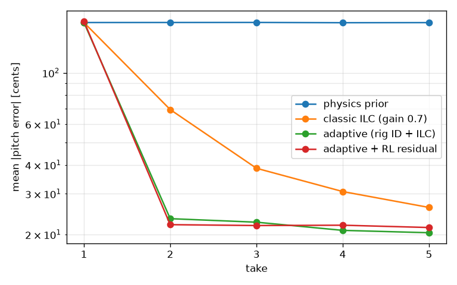

# ちくわ笛ロボット 強化学習環境(Arduino Physical AI チャレンジ 2026)

作品アイデア「[口笛を真似るちくわ笛ロボット](https://airpocket-soundman.github.io/maker_contest_2026/ideas/chikuwa-flute-imitation-robot/)」のための、シミュレーター・強化学習環境・学習スクリプトです。

プロジェクト全体の進め方(6 段階)と現状は [docs/roadmap.md](docs/roadmap.md) にまとめています。

- **numpy だけで動きます**(PyTorch などは不要)。Arduino UNO Q の Linux 側(Debian / Cortex-A53)でそのまま動かす前提です
- gymnasium が入っていれば `gymnasium.Env` として動作し、入っていなければ同じ API の簡易版で動きます(gymnasium 経由での動作確認はまだしていません)

## 構成

```
chikuwa-flute-robot/
├─ docs/
│  ├─ idea.md               作品アイデアのページ(元は maker_contest_2026 のアイデア集)
│  └─ uno_q_model_design.md UNO Q 向けモデル設計メモ
├─ flute_rl/
│  ├─ sim.py       物理シミュレーター(管の共鳴・リニアアクチュエーター・SCS0009・発音の窓・測定ノイズ)
│  ├─ targets.py   お手本の自動生成(カリキュラム)と、口笛の音程軌跡からの変換
│  ├─ env.py       強化学習環境(1 テイク / 複数テイク / フィードバック)と評価ツール
│  ├─ baseline.py  物理モデルだけで作った基準コントローラー(学習の出発点)
│  ├─ adapt.py     テイク間の機体推定(前のテイクの録音からアクチュエーターの速さ・管長を当てはめる)
│  ├─ policy.py    numpy の MLP 方策と、基準コントローラー + 残差の方策
│  └─ pitch.py     YIN による音程抽出(口笛入力・録音の解析用)
├─ scripts/
│  ├─ train_residual_es.py  機体推定つきコントローラーの上に残差方策を ES で学習(並列)
│  ├─ compare.py   コントローラーをテイクごとに比較(信頼区間つき)
│  ├─ train_es.py  進化戦略(ES)で残差方策を学習(旧版)
│  └─ bench.py     各処理の所要時間を測る(UNO Q 実機で実行する用)
└─ tests/          pytest
```

## すぐ試す

```bash
cd chikuwa-flute-robot
python -m pytest -q
python scripts/compare.py --takes 5 --episodes 100 --workers 8
python scripts/train_residual_es.py --feedback --takes 2 --gens 200 --pop 96 --episodes 8 --workers 8 --out runs/feedback.npz
python scripts/bench.py
```

## 環境の仕様

| 項目 | 内容 |
|---|---|
| 時間の刻み | 10ms / ステップ |
| 行動 | `[プランジャーの PWM, 吹き込み角度]`、どちらも -1〜+1(角度は ±15° に対応) |
| エピソード | お手本 1 本を `takes` 回吹く。テイクの間はプランジャーを原点に戻す |
| 風量 | 一定(モデル化していない) |

### お手本(学習用の曲)

`flute_rl/targets.py` の `make_target` が自動で作ります。演奏難易度の高すぎる曲は作りません。

| 決まり | 値 |
|---|---|
| 1 音の長さ | 0.25 秒以上(0.25 / 0.3 / 0.4 / 0.6 / 0.8 秒から選ぶ) |
| 隣の音との跳躍 | 400 セント(長 3 度程度、プランジャー約 20mm)まで |
| 奏法 | 1 曲ごとに「つなげる(スラー・同じ高さはタイ)」「切る(音の間に 50〜120ms の無音)」「混ぜる」のどれか |
| 種類(難易度順) | 1 音 → 2 音 → 2 音のグライド → 短いメロディ → ビブラートつきメロディ |

「切る」は、吹き込み角度を鳴る範囲の外に振って音を止める動きで表現します。無音の区間で鳴ると罰(`-1`)、音符で鳴らないと罰(`-2`)なので、この動きも学習の対象です。評価では、音符の間の短い無音で鳴ってしまった割合を `gap_leak` として出します。

学習では、あらかじめ作った 1,000 曲のセット(`runs/target_bank.npz`、`train_residual_es.py --bank 1000` で自動作成)から毎世代 8 曲を選んで使い回します。評価用の曲は別の乱数で作るので、学習用と重なりません。セットの中身は WAV と図で確認できます:

```bash
python scripts/export_targets.py --bank runs/target_bank.npz --count 20 --out runs/target_preview
```

### 学習する方策のネットワーク

`train_residual_es.py --feedback` で、演奏中に遅れて届く音程を使う方策を学習します。ネットワークは 3 種類から選べます。

| 指定 | 構造 | 狙い |
|---|---|---|
| `--arch mlp` | 記憶なし(今の観測だけ) | 基準 |
| `--arch mlp --history 10` | 直近 10 ステップの「聞こえたずれ・自分の PWM・角度」を窓で渡す | 遅れの情報だけを与える対照 |
| `--arch gru --hidden 16` | リカレント(GRU)。状態は曲の最初に 1 回だけ初期化し、テイクをまたいで持ち越す | 自分の指令が何ステップ後に聞こえるか(個体ごとに違う遅れ)を記憶から学ぶ |

どれも出力は「行動への補正(PWM・角度)」と「聞こえた音をどれだけ信じるか(フィードバックの強さ 0〜2 倍)」です。`scripts/trust_analysis.py` で、方策が場面ごと(休符・音の出だし・音を伸ばしている間)・遅れの長さごとにどれだけ耳を信じているかを集計できます。

### 観測

演奏中は音を聴かずに流し切る前提(案 2)なので、**標準ではリアルタイムの音程は観測に入りません**。

| ブロック | 内容 |
|---|---|
| `target` / `target_mask` | お手本の音程(今から `lookahead` ステップ先まで)と、音があるかどうか |
| `act_hist` | 直近 `history` ステップの自分の行動 |
| `travel` | 自分の PWM 指令を積算した移動量の目安 |
| `angle_readback` | SCS0009 の読み返し角度 |
| `angle_comp` | 発音補償で見つけた「鳴る角度」(唯一のキャリブレーション) |
| `time` | テイク内の経過割合 |
| `prev_err` / `prev_mask` / `prev_act` / `take` | (`takes > 1` のとき)前のテイクの音程のずれと行動。テイクを重ねて上達するための情報 |
| `fb_err` / `fb_heard` / `fb_valid` | (`feedback=True` のとき)`obs_delay` ステップ遅れて届く音程のずれ |

### 報酬(ステップごと)

| 項目 | 値 |
|---|---|
| 音程誤差 | `-min(|ずれ[セント]|, 300) / 100`(鳴るべき区間で、音程が測れたとき) |
| 無音 | 鳴るべき区間で鳴っていない: `-2` |
| 休符中の発音 | `-1` |
| 裏返り(オクターブ上) | `-1` を追加 |
| 行動の急変 | `-0.01 × |Δ行動|²` |

### ドメインランダム化(`FluteParams.sample`)

| 分類 | 項目(公称値 ± 幅) |
|---|---|
| 笛 | 管長 150±10mm、開口端補正 5±2mm、窓の位置 0±4°、窓の幅(下側 5±1.5° / 上側 4±1.5°)、窓の狭まり方、角度による音程変化 10±5 セント/°、裏返り開始位置 |
| 駆動 | 速さ 150±30mm/s(向き別)、不感帯 0.20±0.08、速度の時定数 30±15ms、指令遅れ 0〜2 ステップ、ガタ 0.3±0.2mm |
| サーボ | 速度 600±100°/s、時定数 20±10ms、刻み 300°/1024(固定) |
| 環境・測定 | 気温 25±10℃(約 3 セント/℃)、音程推定ノイズ 3±2 セント、推定の欠落 0〜4%、フィードバック遅れ 1〜5 ステップ |

値はすべて仮です。3D プリント笛・ちくわ・実機のアクチュエーターを実測して置き換えます。

## 結果 2: テイク間の機体推定(PC、2026-09-15)

`scripts/compare.py` で、学習・調整に使っていない 100 条件(カリキュラム進度 0.8)をテイクごとに比較。音程のずれの平均(セント)、[ ] は 95% 信頼区間。



| コントローラー | 1 テイク目 | 2 テイク目 | 3 テイク目 | 4 テイク目 | 5 テイク目 |
|---|---|---|---|---|---|
| 物理モデルだけ | 165 | 165 | 165 | 165 | 165 |
| 古典 ILC(ゲイン 0.7) | 165 | 69.3 [58, 83] | 38.6 [30, 48] | 30.7 [24, 39] | 26.2 [21, 33] |
| **機体推定 + ILC(`AdaptivePolicy`)** | 165 | **23.4 [19, 28]** | **22.6 [19, 27]** | **20.8 [17, 26]** | **20.3 [16, 25]** |
| 機体推定 + ILC + 残差方策(ES) | 167 | 22.0 [18, 26] | 21.9 [17, 27] | 21.9 [16, 29] | 21.4 [16, 28] |

古典 ILC との対応ありの差(機体推定 + ILC): 2 テイク目 **-45.9 セント [-58, -36]**、3 テイク目 -16.0 [-23, -10]、5 テイク目 -5.8 [-9, -3]。どのテイクでも信頼区間が 0 をまたがず、有意に良い。

仕組み(`flute_rl/adapt.py`):

- 1 テイク目のずれの大半は、**その個体のアクチュエーターの速さと管長を知らないこと**が原因だった(真のパラメーターを知っている物理モデルなら 1 テイク目でも約 40 セント)
- そこで、吹き終わった後に「自分が送った PWM」と「録音した音程」から、押し込み・引き戻しの速さ、管長、音程のずれを当てはめる(粗いグリッド探索 → ガウス・ニュートン法、外れ値の閾値を段階的に絞る)。推定した速さと真の速さの相関は約 0.96
- 次のテイクは推定したパラメーターで物理モデルを動かし、残りのずれを ILC で詰める
- 計算は numpy だけ・数十 ms で、テイクの合間に UNO Q の Linux 側で実行できる

強化学習(残差方策)について:

- 機体推定の上に残差方策(2,146 パラメーター)を並列 ES(96 候補 × 8 エピソード × 200 世代)で学習したが、**改善は 2 テイク目で -1.4 セントにとどまり、1 テイク目は +2 セント悪化**。演奏中に音を聴かない方式では、機体推定の後に残るずれは主に音の切り替わり(アクチュエーターの速さの物理的な限界)で、方策で詰められる余地が小さかった
- 前回 ES が失敗したのは、観測できない個体差(1 テイク目で ±200 セント)が評価のばらつきを支配していたため。機体推定でこれを取り除いてから学習すると、学習は安定する(悪化しない)が、伸びしろ自体が小さい

## 結果 3: 演奏中に聞いて直す方策(強化学習)

演奏中に `obs_delay` ステップ遅れて届く音程のずれで、プランジャーの推定位置を直す(`flute_rl/feedback.py`)。手作りの補正(`FeedbackPolicy`)の上に、「行動への補正」と「聞こえた音をどれだけ信じるか(補正の強さ 0〜2 倍)」を出すネットワークを ES で学習した。ネットワークは 3 種類(記憶なし MLP / 直近 10 ステップの履歴つき MLP / GRU)。お手本は 1,000 曲の固定セット(奏法の区別あり)、100 世代で打ち切り。

`scripts/compare.py --feedback --takes 3 --episodes 200`(学習に使っていない 200 条件)、音程のずれの平均(セント):

| コントローラー | 1 テイク目 | 2 テイク目 | 3 テイク目 |
|---|---|---|---|
| 物理モデルだけ | 165 | 165 | 165 |
| 古典 ILC(ゲイン 0.7) | 165 | 71 | 37 |
| 機体推定 + ILC | 165 | 19 | 18 |
| 機体推定 + 演奏中の補正(手作り) | 62 | 23 | 22 |
| + 強化学習(記憶なし MLP) | 44 | 20 | 20 |
| + 強化学習(履歴つき MLP) | **38** | 19 | 20 |
| + 強化学習(GRU) | 44 | **17** | **17** |

- 演奏中に聞くことで初めて 1 テイク目が直せる。強化学習は手作りの補正に対して 1 テイク目で約 20 セント良い(対応ありの差の信頼区間は 0 をまたがない)
- 3 種類のネットワークの差は小さく、記憶(GRU)の効果ははっきりしなかった
- 強化学習の方策は音が出ている割合が少し下がる(GRU で 0.99)。報酬の上では、大きくずれるより黙るほうが罰が軽いため

## 結果 4: 厳しめのシミュレーター(`harsh`)

聞き比べでどの方式も合格に聞こえたことから、シミュレーターが甘すぎるという指摘を受けて見直した。制御側はシミュレーターと同じ形の式を持っていて、機体推定は「値だけ違う」機体を当てはめていた。そこで、制御側が知らない効果を `FluteParams.sample(harsh=...)` で入れられるようにした:

| 分類 | 効果(`harsh=1` での範囲。すべて推測の値) |
|---|---|
| モーター | 静止摩擦(動き出しに PWM が +0〜0.15 余分に要る)、PWM と速さの非線形(指数 0.7〜1.5)、差し込むほど遅くなる(0〜30%)、演奏中の速さの揺らぎ、動きの雑音(0〜10%)、指令が 1 ステップ遅れる確率(0〜15%)、ガタ +0〜0.7mm |
| 鳴る角度 | 鳴り始めの遅れ(20〜80ms)、鳴り始めの窓が鳴り続ける窓より各側 0〜1.5° 狭い(ヒステリシス)、窓の端で確率的に音が切れる、最適な角度が差し込み量で ±3° 動く、息による音程の揺らぎ(0〜8 セント)、裏返りやすさ |
| 聞き取り | 音程の推定がオクターブずれる確率(0〜5%) |

`harsh=0` なら以前とまったく同じ機体・動きになる(テストで確認)。学習し直さずに `--harsh 1.0` で評価した結果(同じ 200 条件):

| コントローラー | 1 テイク目 | 2 テイク目 | 3 テイク目 |
|---|---|---|---|
| 物理モデルだけ | 200 | 202 | 200 |
| 古典 ILC(ゲイン 0.7) | 200 | 143 | 117 |
| 機体推定 + ILC | 200 | 79 | 80 |
| 機体推定 + 演奏中の補正(手作り) | 108 | 67 | 66 |
| + 強化学習(記憶なし MLP) | 89 | 58 | 60 |
| + 強化学習(履歴つき MLP) | 87 | 61 | 63 |
| + 強化学習(GRU) | 89 | 58 | 61 |

- 2 テイク目のずれが 3〜4 倍になり、テイクを重ねても良くならなくなった。これまでの結果は、シミュレーターの甘さに大きく助けられていた
- それでも順位は変わらず、機体推定・演奏中の補正・強化学習のそれぞれに効果は残っている
- 厳しいシミュレーターでの学習し直しは GPU 版(`scripts/train_es_gpu.py --harsh 1.0`)で進めている

## 結果 5: 厳しいシミュレーターでの学習し直しと、耳で聞く方策(E2E 方法 A)

`scripts/train_es_gpu.py --harsh 1.0` で 3 つの方策を 100 世代学習し直した(甘い機体で学習したモデルから開始)。E2E の方法 A(`--hearing runs/pitchnet_self.pt`)では、シミュレーターの中で笛の音を鳴らし(8kHz、`flute_rl/torch_audio.py`)、学習済みの耳のネットワークで `obs_delay` 遅れて聞かせる。演奏中の補正と機体推定には耳が聞き取った音程を使い、方策には耳の自信の度合いと特徴の要約(PCA 16 次元)も渡す。

`scripts/compare_gpu.py --harsh 1.0 --takes 3 --episodes 200`(学習に使っていない 200 条件)、音程のずれの平均(セント):

| コントローラー | 1 テイク目 | 2 テイク目 | 3 テイク目 | 音が出ている割合 |
|---|---|---|---|---|
| 手作りの補正(測定値で聞く) | 104.0 | 66.6 | 64.9 | 0.96 |
| 手作りの補正(耳で聞く) | 109.6 | 65.4 | 67.5 | 0.96 |
| 甘い機体で学習: 記憶なし MLP / 履歴つき MLP / GRU | 89.5 / 87.8 / 87.4 | 57.9 / 59.3 / 57.0 | 58.4 / 62.4 / 60.4 | 0.94 / 0.93 / 0.92 |
| 学習し直した後: 記憶なし MLP | 89.3 | 62.3 | 62.7 | 0.96 |
| 学習し直した後: 履歴つき MLP | **84.6** | 56.5 | **57.3** | 0.96 |
| 学習し直した後: GRU | 86.9 | 58.0 | 61.1 | 0.96 |
| 学習し直した後: GRU(耳で聞く、方法 A) | 91.0 | **55.3** | 61.2 | 0.96 |

- 耳は測定値の代わりに使える(手作りの補正で比べて、差は信頼区間の範囲内)
- 学習し直しの伸びは約 3 セントと小さい。変わったのは、黙って点を稼ぐ癖が消えたこと(音が出ている割合が 0.96 に戻った)
- 耳の特徴を渡しても(方法 A)、はっきりした効果はなかった
- `scripts/trust_analysis.py --harsh 1.0` で見ると、GRU は耳を信じる度合いを場面や遅れによらず約 1.8 倍にしているだけ
- 学習した方策は手作りの補正より 15〜20% 良いところで頭打ち。制御側の機体モデル(機体推定の式)が機体の形に合っていないことが一番の原因と考えている。次は、実物の測定でシミュレーターを合わせ込み、機体推定のモデルを広げる

## GPU 版(`flute_rl/torch_sim.py`、`flute_rl/torch_env.py`)

多数の機体をまとめて 1 ステップずつ進める版。雑音のない機体では、行動が numpy 版と 1 ステップずつ一致する(GRU を含む)。1 世代 768 回の演奏では CPU 20 コアの numpy 版とほぼ同じ速さ(約 6 秒)で、候補を 10 倍にすると 1 秒あたりの演奏数が約 2.3 倍になる。細かい計算の呼び出しが時間を決めているので、さらに速くするには計算をまとめる工夫が要る。

開発の経緯と、世代ごとの演奏の聞き比べは [docs/history.html](docs/history.html) にある。

## 結果 1: 最初の実験(PC、2026-09-15 時点)

ランダム化した 20 条件(カリキュラム進度 0.8)での、音程のずれの平均(セント)。

| コントローラー | 1 テイク目 | 2 テイク目 | 3 テイク目 | 4 テイク目 | 5 テイク目 |
|---|---|---|---|---|---|
| 物理モデルだけ(`PhysicsPriorPolicy`) | 202 | 202 | 202 | 202 | 202 |
| + 古典 ILC、ゲイン 0.5(`ILCPolicy`) | 202 | 118 | 78 | 63 | 52 |
| + 古典 ILC、ゲイン 0.7 | 202 | 90 | 61 | 51 | 44 |
| + 古典 ILC、ゲイン 0.9 | 202 | 77 | 54 | 49 | 45 |
| 物理モデル + ES 残差(40 世代、学習率 0.03) | 333 | 175 | 298 | - | - |
| ILC(ゲイン 0.7)+ ES 残差(25 世代、学習率 0.005、σ 0.02) | 212 | 82 | 61 | - | - |

分かったこと:

- アクチュエーターの速さの個体差(±20%)があると、音を聴かずに推測で動かすだけでは 1 テイク目が平均 200 セントずれる。1 テイク目の中ではこの個体差を知る手段がない
- 前のテイクのずれを観測に入れれば、古典的な ILC だけでもテイクごとに上達する(5 テイクで 202 → 44 セント)。環境の設計どおりに動いている
- **ES による残差方策の学習は、最初の設定では失敗した**(物理モデルより悪化)。評価のばらつき(1 候補あたり 4 エピソード)に対して更新が大きすぎたと考えられる。学習率・ノイズを下げ、出発点を ILC にした再学習では悪化はしなくなったが、ILC だけ(202 / 90 / 61)と比べて**有意な改善もなかった**(2 テイク目がわずかに良く、1 テイク目がわずかに悪い程度で、評価のばらつきの範囲)
- 今の ES(1 世代 16 候補 × 数エピソード)では、7,400 パラメーターの方策を動かすには評価が粗すぎる。次の手は、候補数・エピソード数を増やして並列化する、観測を絞って方策を小さくする、ILC のゲインなど数個のパラメーターだけを学習させる、のいずれか

## 次にやること

- 実機ログから `FluteParams` を当てはめる(世界モデルの実測合わせ)と、残差モデルの追加
- フィードバック補正方策(`feedback=True`)の学習と、MCU に載せる小型化
- 口笛の録音 → `pitch.pitch_track` → `targets.from_pitch_track` → 方策、の一連の流れを実機で通す
